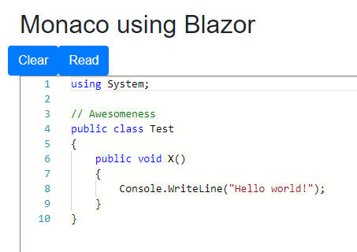

## Monaco Component for Blazor

Please leave your feedback as an issue or star the repo or let me know on [@david_n_m_bond](https://twitter.com/david_n_m_bond).

This project started from [@ma_khan](https://twitter.com/ma_khan)'s excellent ChartJs Blazor component project codebase.


## Prerequisites

Don't know what Blazor is? Read [here](https://github.com/aspnet/Blazor)

Blazor dependencies:
1. VS 15.7 or higher
2. DotNetCore 2.1 Preview 2 or higher


## Installation

...to follow...

To Install

```
Install-Package BlazorComponents.Monaco
```
or
```
dotnet add package BlazorComponents.Monaco
```

## Usage

1. In cshtml file add this:

```html
@page "/"
@using BlazorComponents.Monaco
@using BlazorComponents.Shared

<h2>Monaco using Blazor</h2>
<div class="row">
	<button class="btn btn-primary" onclick="@Reset">Clear</button>
	<button class="btn btn-primary" onclick="@Update">Read</button>
</div>
<MonacoEditor ref="_editor" EditorModel="@_editorModel" Width="600" Height="300" />
@functions {
EditorModel _editorModel { get; set; }
MonacoEditor _editor;

protected override void OnInit()
{
	_editorModel = new EditorModel
	{
		Language = "csharp",
		Script = @"using System;

// Awesomeness
public class Test
{
	public void X()
	{
		Console.WriteLine(""Hello world!"");
	}
}"
	};
}

public void Update()
{
	_editor.EditorUpdate();
}

public void Reset()
{
	_editor.EditorSetValue("");
}
}
```

2. In index.html add:

```html
	<link rel="stylesheet" data-name="vs/editor/editor.main" href="monaco-editor/min/vs/editor/editor.main.css">
	<script src="monaco-editor/min/vs/loader.js"></script>

...

	<script src="monaco-editor/min/vs/editor/editor.main.nls.js"></script>
	<script src="monaco-editor/min/vs/editor/editor.main.js"></script>
	<script type="blazor-boot">
	</script>
```

## Sample Output




